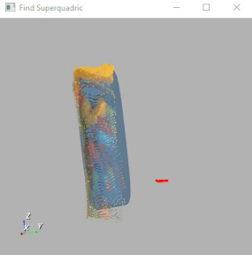

Fit a partial point cloud with a superquadric
=============================================

[](https://gitpod.io/#https://github.com/robotology/find-superquadric)

Solve an optimization problem to find out the best superquadric that fits a given partial point cloud.

### Note
The superquadric is parametrized in terms of its center, the shape, the principal axes and a rotation angle around the z-axis, in order to account for objects that are supposed to be lying on a table parallel to the x-y plane (to keep things simple :wink:).

:warning: If the input point cloud does not guarantee that the above assumptions hold, it will need to be first transformed through a convenient rototraslation.

The equation of the superquadric is the following:


### Dependencies
- [YARP](https://github.com/robotology/yarp)
- [iCub](https://github.com/robotology/icub-main)
- [Ipopt](https://github.com/coin-or/Ipopt)
- [VTK](https://github.com/Kitware/VTK)

### Command-line options
- `--file file-name`: specify the file containing the point cloud given in the following plain format:
  ```
  x0 y0 z0 [r0 g0 b0]
  x1 y1 z1 [r1 g1 b1]
  ...
  ```
  RGB colors are optional.
- `--remove-outliers "(<radius> <minpts>)"`: outliers removal based on spatial density clustering. The aggregation of points in clusters is regulated through the distance _radius_, whereas _minpts_ represents the minimum number of points of a valid cluster. Only points belonging to the largest cluster will survive as inliers.
- `--uniform-sample <int>`: specify the integer step for performing uniform down-sampling as follows:
  - `1` means no down-sampling
  - `> 1` enables down-sampling
- `--random-sample <double>`: specify the percentage in [0,1] for performing random down-sampling.
- `--inside-penalty <double>`: specify how much to penalize points that will lie inside the superquadric's isosurface wrt points lying outside (default = 1.0).
- `--disable-viewer`: specify not to launch the viewer.
- `--color "(<r> <g> <b>)"`: change the color of the superquadric by specifying RGB components as double in the range [0,1].
- `--opacity <double>`: specify the opacity of the superquadric as double in the range [0,1].
- `--background-color "(<r> <g> <b>)"`: change background color by specifying RGB components as double in the range [0,1]. 

### Real-time mode
If no `--file` option is passed through the command line, the module will open up a port called `/find-superquadric/points:rpc` to which the point cloud can be sent as a `yarp::sig::PointCloud<yarp::sig::DataXYZRGBA>` object.
Then, the module will reply with the superquadric parameters:
```
center-x center-y center-z angle size-x size-y size-z epsilon-1 epsilon-2
```
The `angle` around the z-axis is returned in degrees, whereas `center-*` and `size-*` are expressed in the same length units of the input point cloud.

### Example
```sh
$ find-superquadric --remove-outliers "(0.01 10)" --random-sample 0.2 --file ./data/cylinder
```

### Output


### 👨🏻‍💻 Maintainers
This repository is maintained by:

| | |
|:---:|:---:|
| [](https://github.com/pattacini) | [@pattacini](https://github.com/pattacini) |

